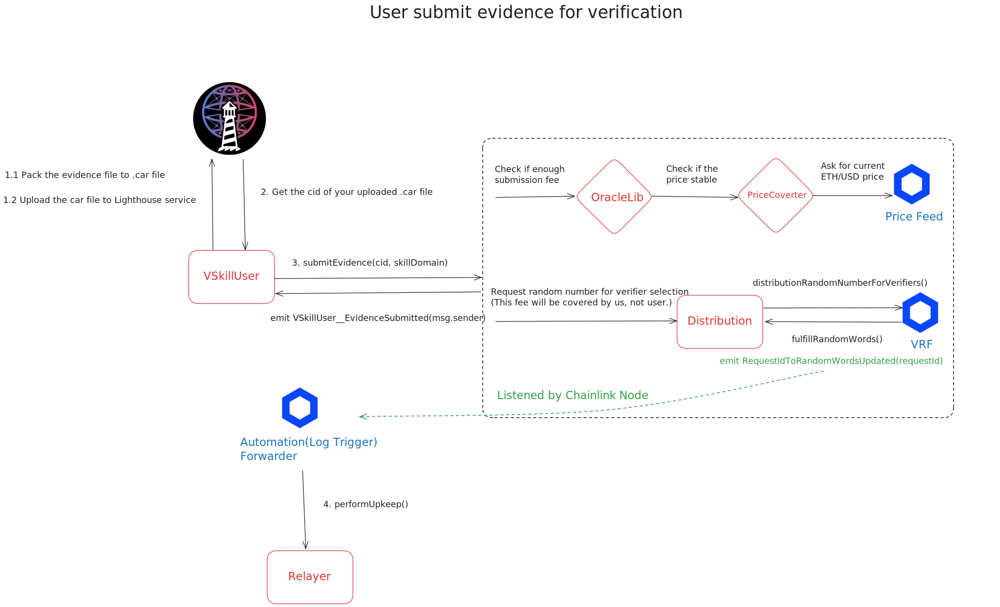
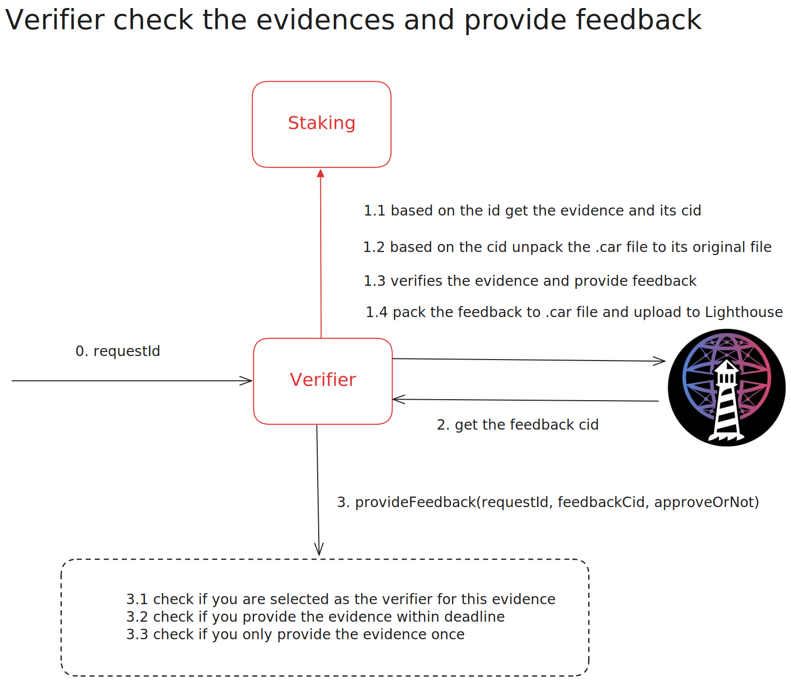
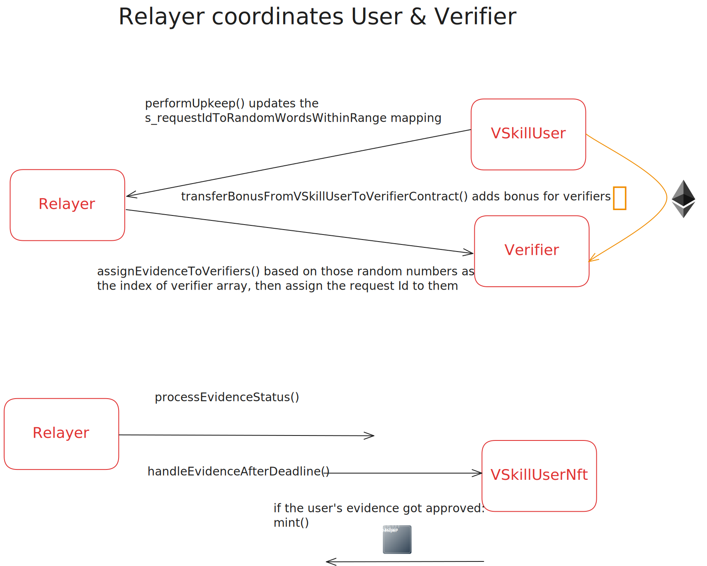

<div align="center">

</div>

 <h1 align="center">
VSkill - v2
</h1>

## About the Project

VSkill (VeriSkill) is a decentralized platform for verifying skills. It leverages blockchain technology to create a transparent and trustworthy system for skill verification. The platform involves three key roles:

1. Users: Submit evidence to be verified.
2. Verifiers: Stake money to become verifiers, review evidence, and decide on skill verification.
3. Owner: Can modify submission fees and supported skills for verification.

## Built With

- Solidity
- Yul
- OpenZeppelin
- Foundry
- Filecoin(Lighthouse)
- Chainlink (Price Feed, VRF, Automation)

## Features

- Staking mechanism for verifiers
- Reputation system for verifiers
- Incentive mechanism to encourage correct verifications
- Filecoin(Lighthouse) integration for evidence submission and feedback storage
- NFT minting for verified skills
- Random assignment of evidence to verifiers using Chainlink VRF
- Automated evidence distribution using Chainlink Automation
- Real-time USD/ETH price conversion using Chainlink Price Feed

## Key Process

1. User submits evidence for verification.



2. Verifier check evidence and provide feedback.



3. Relayer coordinates the user and verifier.



## Getting Started

### Prerequisites

- Foundry
- Git
- CMake

### Installation

1. Clone the repository:
   ```
   git clone https://github.com/cqlyj/VSkill
   ```
2. Navigate to the project directory:
   ```
   cd VSkill
   ```
3. Install dependencies:
   ```
   make install
   ```
4. Build the project:
   ```
   make build
   ```

## Usage

1. Start a local Ethereum node:

   ```javascript
   make anvil
   ```

2. Deploy the contracts in the following order:

   1. VSkillUserNft.sol
   2. Distribution.sol
   3. VSkillUser.sol
   4. Verifier.sol
   5. Relayer.sol

   ```javascript
   // Deploy to local anvil network

   make deploy ContractName

   // Deploy to specific network (e.g., sepolia)

   make deploy ContractName NETWORK=Sepolia

   ```

3. Update all the necessary parameters in helper configs and initialize the contracts:

   ```javascript
   make initialize
   ```

   or

   ```javascript
   make initialize NETWORK=${NETWORK}
   ```

4. Interact with the contracts using the commands in the Makefile. You can view all available commands with:

   ```javascript
   make help
   ```

## Testing

VSkill includes a comprehensive test suite to ensure the reliability and correctness of the smart contracts.

To run the tests:

```javascript
// Run all tests on local network
make test

// Run tests on specific network
make test NETWORK=Sepolia
```

## Additional Testing Options

```javascript
//Generate test coverage report
make coverage-report

//Create a gas snapshot
make snapshot
```

## Audit Tools

```javascript
//Run Slither analysis
make slither

//Run Aderyn analysis
make aderyn

//View project structure
make scope
```

## Deployment

To deploy VSkill to a testnet or mainnet:

1. Set up your environment variables:

   ```
   cp .env.example .env
   ```

   Edit .env and add your:

   - RPC URLs for each network
   - Private key or burner account details
   - Etherscan API keys for verification
   - Other required configuration variables

2. Run the deployment script:
   ```javascript
   make deploy ContractName NETWORK=NetworkName
   ```

## zkSync local node instructions

In case you want to deploy to the layer 2 zkSync local network, you can follow the instructions in file `zksync-node-instructions.md`.

## Additional Features

### File Management and Lighthouse Integration

```javascript
//Convert files to CAR format
make packToCar evidence=your_file.txt // or whatever file format you have

//Convert CAR files back to original
make unpackToOrigin carfile=your_file.car output=output_file.txt // or whatever file format you have

//Lighthouse operations
make lighthouse-import-wallet private-key=your_key
make lighthouse-generate-api-key
make lighthouse-upload carfile=your_file.car
```

## How to Contribute

We welcome contributions to VSkill! Here's how you can help:

### Types of Contributions

- **Bug Reports**: Open an issue describing the bug, including steps to reproduce, expected behavior, and actual behavior
- **Feature Requests**: Submit an issue describing the new feature and its potential benefits
- **Code Contributions**: Submit pull requests for bug fixes or new features
- **Documentation**: Help improve or translate our documentation
- **Testing**: Add more test cases or help identify test coverage gaps

### Development Process

1. Fork the repository and create your branch from `main`:

   ```
   git checkout -b feature/your-feature-name
   ```

2. If you've added code, add tests that cover your changes:

   ```
   forge test
   ```

3. Ensure your code follows the project's style guidelines:

   ```
   make slither
   make aderyn
   ```

4. Make sure all tests pass:

   ```
   forge coverage
   ```

5. Update the documentation if necessary

### Pull Request Process

1. Update the README.md with details of changes if applicable
2. Follow the existing code style and formatting
3. Include comments in your code where necessary
4. Add or update tests for any new functionality
5. Reference any relevant issues in your PR description
6. The PR must pass all CI checks and receive approval from a maintainer

### Commit Guidelines

- Use clear and meaningful commit messages
- Reference issue numbers in commit messages when applicable
- Keep commits focused on single changes
- Use present tense ("Add feature" not "Added feature")

### Code of Conduct

- Be respectful and inclusive in your interactions
- Focus on constructive feedback
- Help maintain a positive environment for all contributors

### Questions or Need Help?

Feel free to reach out if you have questions or need guidance:

- Open a GitHub issue for project-related questions
- Contact Luo Yingjie at [luoyingjie0721@gmail.com](luoyingjie0721@gmail.com) for other inquiries

Your contributions help make VSkill better for everyone. Thank you for your interest in contributing!

## License

This project is licensed under the MIT License - see the [LICENSE](LICENSE) file for details.
