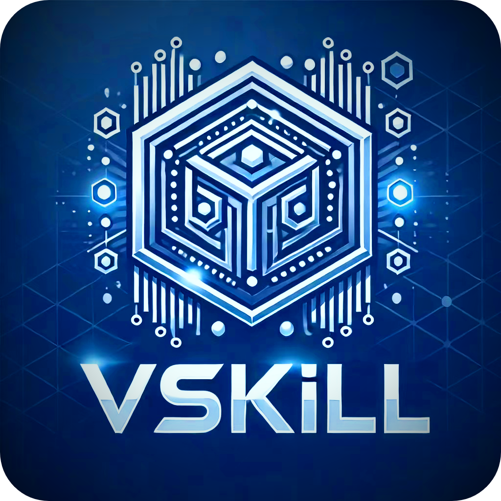

<div align="center">

</div>

 <h1 align="center">
VSkill (VeriSkill)
</h1>

## About the Project

VSkill (VeriSkill) is a decentralized platform for verifying skills. It leverages blockchain technology to create a transparent and trustworthy system for skill verification. The platform involves three key roles:

1. Users: Submit evidence to be verified.
2. Verifiers: Stake money to become verifiers, review evidence, and decide on skill verification.
3. Owner: Can modify submission fees and supported skills for verification.

## Built With

- Solidity
- OpenZeppelin
- Foundry
- IPFS
- Chainlink (Price Feed, VRF, Automation)

## Features

- Staking mechanism for verifiers
- Reputation system for verifiers
- Incentive mechanism to encourage correct verifications
- IPFS integration for evidence submission
- NFT minting for verified skills
- Random assignment of evidence to verifiers using Chainlink VRF
- Automated evidence distribution and status checking using Chainlink Automation
- Real-time USD/ETH price conversion using Chainlink Price Feed

## Architecture

VSkill consists of several key modules that work together to create a decentralized skill verification platform:


1. Staking Module:

   - Manages verifier staking and reputation
   - Handles incentive distribution

2. User Module:

   - Manages user evidence submission
   - Tracks evidence status

3. User NFT Module:

   - Mints NFTs for verified skills

4. Distribution Module:

   - Uses Chainlink VRF for random assignment of evidence to verifiers

5. Verifier Module:
   - Manages verifier feedback submission
   - Handles evidence re-distribution in case of conflicting opinions

## Getting Started

### Prerequisites

- Foundry
- Git
- CMake

### Installation

1. Clone the repository:
   ```
   git clone https://github.com/cqlyj/VSkill
   ```
2. Navigate to the project directory:
   ```
   cd VSkill
   ```
3. Install dependencies:
   ```
   make install
   ```
4. Build the project:
   ```
   make build
   ```

## Usage

1. Start a local Ethereum node:

   ```
   anvil
   ```

2. Deploy the contracts you want to interact with(You can find the commands in the `Makefile`):

   ```
   make deploy-/*THE CONTRACT YOU WANT TO INTERACT*/
   ```

3. Interact with the contracts using the provided scripts in `Makefile`.

## Testing

VSkill includes a comprehensive test suite to ensure the reliability and correctness of the smart contracts.

To run the tests:

```
forge test
```

For more verbose output:

```
forge test -vv
```

## Deployment

To deploy VSkill to a testnet or mainnet:

1. Set up your environment variables:

   ```
   cp .env.example .env
   ```

   Edit `.env` and add your RPC URL and private key.

2. Run the deployment script:
   ```
   make deploy-/*THE CONTRACT YOU WANT TO DEPLOY*/
   ```

Make sure to configure the Chainlink oracles and other necessary parameters after deployment.

## License

This project is licensed under the MIT License - see the [LICENSE](LICENSE) file for details.

## Contact

Luo Yingjie - [luoyingjie0721@gmail.com](luoyingjie0721@gmail.com)
