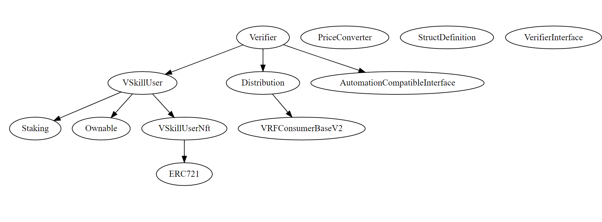

# VSkill Security Review Onboarding

# Table of Contents

- [VSkill Security Review Onboarding](#vskill-security-review-onboarding)
- [Table of Contents](#table-of-contents)
- [About the project](#about-the-project)
  - [Features](#features)
  - [Architecture](#architecture)
- [Stats](#stats)
- [Setup](#setup)
  - [Requirements](#requirements)
  - [Installation](#installation)
  - [Testing](#testing)
- [Security Review Scope](#security-review-scope)
  - [Commit Hash](#commit-hash)
  - [Repo URL](#repo-url)
  - [In scope vs out of scope contracts](#in-scope-vs-out-of-scope-contracts)
  - [Compatibilities](#compatibilities)
- [Roles](#roles)
- [Known Issues](#known-issues)

# About the project

VSkill (VeriSkill) is a decentralized platform for verifying skills. It leverages blockchain technology to create a transparent and trustworthy system for skill verification.

## Features

- Staking mechanism for verifiers
- Reputation system for verifiers
- Incentive mechanism to encourage correct verifications
- IPFS integration for evidence submission
- NFT minting for verified skills
- Random assignment of evidence to verifiers using Chainlink VRF
- Automated evidence distribution and status checking using Chainlink Automation
- Real-time USD/ETH price conversion using Chainlink Price Feed

## Architecture

VSkill consists of several key modules that work together to create a decentralized skill verification platform:



1. Staking Module:

   - Manages verifier staking and reputation
   - Handles incentive distribution

2. User Module:

   - Manages user evidence submission
   - Tracks evidence status

3. User NFT Module:

   - Mints NFTs for verified skills

4. Distribution Module:

   - Uses Chainlink VRF for random assignment of evidence to verifiers

5. Verifier Module:
   - Manages verifier feedback submission
   - Handles evidence re-distribution in case of conflicting opinions

# Stats

- nSLOC: 1194
- Complexity Score: 646
- Security Review Timeline: 2024/10/25 - 2024/11/08(2 weeks)

# Setup

## Requirements

- Foundry
- Git
- CMake

## Installation

1. Clone the repository:
   ```bash
   git clone https://github.com/cqlyj/VSkill
   ```
2. Navigate to the project directory:
   ```bash
   cd VSkill
   ```
3. Install dependencies:
   ```bash
   make install
   ```
4. Build the project:
   ```bash
   make build
   ```

## Testing

VSkill includes a comprehensive test suite to ensure the reliability and correctness of the smart contracts.

To run the tests:

```bash
forge test
```

For more verbose output:

```bash
forge test -vv
```

Forking Test is also supported but for now not considered the gas on forked testnet so most of test cases will fail.

# Security Review Scope

```bash
./src/
├── nft
│   └── VSkillUserNft.sol
├── oracle
│   └── Distribution.sol
├── staking
│   └── Staking.sol
├── user
│   └── VSkillUser.sol
├── utils
│   ├── interface
│   │   └── VerifierInterface.sol
│   └── library
│       ├── PriceCoverter.sol
│       └── StructDefinition.sol
└── verifier
    └── Verifier.sol
```

## Commit Hash

```bash
cfc7fb2dad65a4902e83aa9673c4d4ed1e7f1448
```

## Repo URL

https://github.com/cqlyj/VSkill

## In scope vs out of scope contracts

The `/lib` directory is out of scope for the security review.

## Compatibilities

- Solc Version: ^0.8.24
- Chain(s) to deploy contract to:
  - Ethereum Sepolia Testnet
  - ZkSync Sepolia Testnet(For now not supported)
  - Local anvil chain
  - Local ZkSync chain(For now not supported)
- Tokens:
  - VSkillUserNft(ERC721s)

# Roles

```
1. Users: Submit evidence to be verified.
2. Verifiers: Stake money to become verifiers, review evidence, and decide on skill verification.
3. Owner: Can modify submission fees and supported skills for verification.
```

# Known Issues

1. The verifier may be chosen multiple times for the same evidence and can make different decisions. This is allowed by the current design but may lead to disputes.
2. The owner can modify the submission fees and supported skills, which may lead centralized control over the platform. But for now since only deployed on testnet, it's not a big issue.
3. The fork test will always fail due to the gas issue.
4. The `reward` function will distribution different amount of rewards to the verifiers. Those addresses which call the function earlier will get more rewards than those who call the function later.
5. The `Verifier` contract size is above limit:
   ```bash
   `Unknown2` is above the contract size limit (35616 > 24576).
   ```
